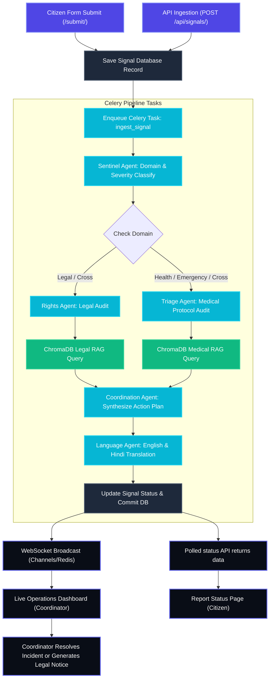

# Prahari 🛡️ — Real-time Civic Intelligence & Response

Prahari is a real-time civic intelligence and incident management platform designed to empower citizens, support NGOs, and assist operations coordinators. It ingests raw civic signals (text, SMS, webhooks), processes them sequentially through a **5-Agent AI Pipeline** backed by **Retrieval-Augmented Generation (RAG)** over Indian legal databases and emergency medical protocols, and translates the output dynamically into English or Hindi. Live incident alerts are streamed in real time to a WebSocket-powered operations dashboard for coordinator intervention, notice generation, and resolution tracking.

**Live Deployment URL**: [https://prahari-zbgm.onrender.com](https://prahari-zbgm.onrender.com)

---

## Pictorial Flowchart (Interconnection Architecture)

Below is the complete data flow pipeline from the starting point of signal ingestion to the WebSocket operations dashboard and the citizen status page:



---

## Project Folder Structure

The repository is structured as a modular Django application. Below is the directory map:

```text
Prahari/
├── apps/
│   ├── agents/             # Core multi-agent AI system logic and LLM orchestration
│   │   ├── management/     # Seed management command scripts to generate dummy alerts
│   │   ├── agents.py       # Individual implementations of Sentinel, Rights, Triage, Coord, Lang agents
│   │   ├── apps.py         # App initialization & startup configuration hooks
│   │   └── base.py         # Parent BaseAgent wrapper defining API retry rules & Fallback LLaMA logic
│   ├── audit/              # Operations log audit module tracking agent tasks timings and latency
│   ├── incidents/          # Incidents backend handling coordinators actions, notifications and WebSockets
│   │   ├── consumers.py    # Django Channels WebSocket connection consumer (Dashboard updates)
│   │   ├── coordinator_views.py # Backoffice Dashboard controllers and incident resolution actions
│   │   ├── models.py       # DB schema for Incident cases, resolving outcomes and coordinators updates
│   │   ├── routing.py      # WebSocket URL routing patterns for operational feeds
│   │   └── views.py        # Legal Notice creation APIs and statistics outcomes controllers
│   ├── signals/            # Public-facing ingest interfaces and citizen search trackers
│   │   ├── citizen_views.py # Views rendering status timelines and submitting citizen incidents
│   │   ├── models.py       # Signal ingestion database schema
│   │   ├── urls.py         # Sub-paths for API code verification and manual ingest endpoints
│   │   └── views.py        # Public Signal creation APIs
│   ├── resources/          # Resource directory tracking nearby equipment pools
│   └── tenants/            # Tenant isolation layer mapping developer domains and access API keys
├── config/                 # Main Django config module containing project settings
│   ├── settings/           # Settings configurations (dev.py, production.py)
│   ├── asgi.py             # ASGI interface configuration (enables live WebSockets via Daphne)
│   ├── routing.py          # Root Django Channels ASGI WebSocket channel routes
│   └── urls.py             # Root URL patterns mapping views and REST framework routes
├── pipeline/               # Celery processing task queue and sequence coordinator
│   └── tasks.py            # Tasks enqueued on Redis managing the sequential execution of AI Agents
├── prompts/                # Plaintext system instruction prompt templates loaded by LLM Agents
│   ├── sentinel.txt        # System guidelines classifying domains & severities
│   ├── rights.txt          # Guidelines for RAG context extraction and constitutional audits
│   ├── triage.txt          # Rules determining medical urgency, golden windows and hospital denials
│   ├── coordination.txt    # Synthesizer creating measuring demands and resources needed
│   └── language.txt        # Translation prompt matching preferred citizen language (English/Hindi)
├── rag/                    # Retrieval-Augmented Generation retrieval engines
│   ├── chroma_db/          # SQLite vector binary database directory containing index embeddings
│   ├── ingest.py           # Embeds legal provisions (CrPC, IPC, BNSS, BNS) and trauma guidelines
│   └── retriever.py        # Retrieval helper querying vector spaces using cosine similarity
├── templates/              # HTML layout files utilizing Django Template Inheritance
│   ├── base.html           # Parent template layout defining CSS variables, headers, and footer
│   ├── home.html           # Citizen landing containing the case search bar and hero actions
│   ├── submit.html         # Incident reporting form utilizing anonymous toggle actions
│   ├── report_status.html  # Status timelines, case reports, notice modals and closure tools
│   ├── login.html          # Coordinator authentication card
│   ├── coordinator_dashboard.html # Operations monitor featuring WebSocket updates
│   ├── coordinator_detail.html    # Resolution forms, RAG outputs tabs, and legal notices actions
│   └── dashboard.html      # Full-screen live OPERATIONS radar feed
├── manage.py               # Django operations entry point wrapper
├── requirements.txt        # Virtual Environment dependencies requirements list
└── README.md               # Complete architecture walkthrough
```

---

## Technical Stack

- **Backend Framework**: Django 5 + Django REST Framework (DRF)
- **Real-Time Pipelines**: Django Channels 4 (ASGI Server: Daphne)
- **Message Broker & Channel Layer**: Redis 7
- **Task Queue Runner**: Celery 5
- **Database Engine**: PostgreSQL 16 + PostGIS 3.4 (Geospatial lookup and GIS distance metrics support)
- **Vector Embeddings Store**: ChromaDB
- **Retrieval Sentence Embedder**: `sentence-transformers/all-MiniLM-L6-v2`
- **Primary LLM**: Groq LLaMA 3.3 70B (`llama-3.3-70b-versatile`)
- **Fallback LLMs**: Groq `openai/gpt-oss-120b` and `openai/gpt-oss-20b` (fallback routing when primary LLM encounters a 429 rate limit)
- **Authorization Layer**: JSON Web Tokens (JWT)

---

## Application Screenshots (Visual Gallery)

<div align="center">

<table>
<tr>
<td width="50%" align="center">

### Citizen Portal — Submission Page


</td>

<td width="50%" align="center">

### Citizen Portal — Tracking Progress


</td>
</tr>

<tr>
<td width="50%" align="center">

### Operations Dashboard — WebSocket Live Feed


</td>

<td width="50%" align="center">

### Operations Dashboard — Legal RAG Audit


</td>
</tr>
</table>

</div>

---

## Setup & Local Running Instructions

1. **Clone the repository**:
   ```bash
   git clone <repository_url>
   cd Prahari
   ```
2. **Copy `.env.example` to `.env` and fill the variables**:
   ```bash
   cp .env.example .env
   ```
3. **Start local infrastructure (Docker Compose)**:
   ```bash
   docker compose up -d
   ```
4. **Install Python dependencies**:
   ```bash
   pip install -r requirements.txt
   ```
5. **Run DB Migrations**:
   ```bash
   python manage.py migrate
   ```
6. **Ingest legal & medical databases into ChromaDB**:
   ```bash
   python manage.py ingest_knowledge_base
   ```
7. **Populate demo alerts & trigger analysis pipelines**:
   ```bash
   python manage.py seed_demo
   ```
8. **Start Celery worker queue** (Terminal 2):
   ```bash
   celery -A config worker --loglevel=info --pool=solo
   ```
9. **Start Daphne ASGI Web Server** (Terminal 3):
   ```bash
   daphne -b 0.0.0.0 -p 8000 config.asgi:application
   ```

---

## Recent Updates (June 2026)

- **Browser Tab Switching Fix**: Resolved `ReferenceError: event is not defined` inside `switchTab()` on the coordinator detail page by passing the element context (`this`) to the function.
- **Private Browsing Protection**: Wrapped all `localStorage` access in safe helper functions (`getSavedLang`, `saveLang`) with `try-catch` blocks to prevent template crashes when cookie/storage policies are restrictive.
- **Fallback LLM Quality Upgrades**: Reordered LLM fallbacks to prioritize the `openai/gpt-oss-120b` (120B parameter) model over smaller 20B/8B models, and completely removed the decommissioned `llama-3.1-8b-instant` model from the routing list.

